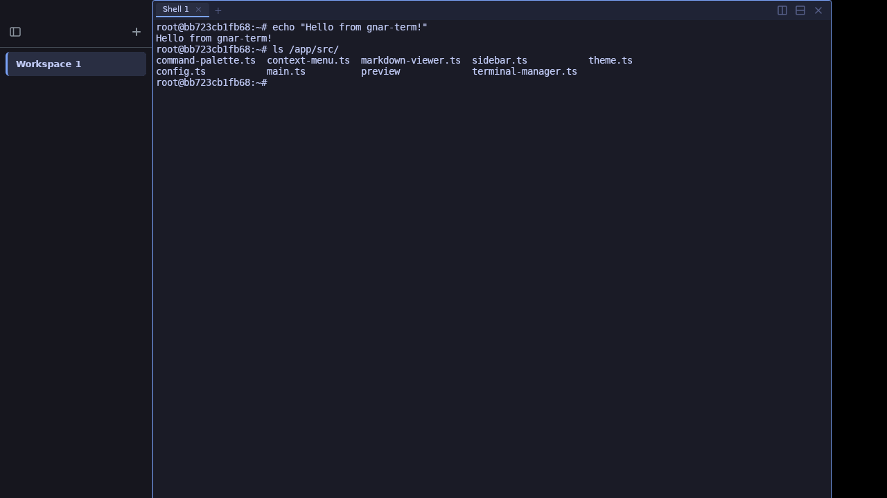

<h1 align="center">🤙 gnar-term</h1>
<p align="center">A cross-platform terminal workspace manager with built-in file previews, themes, and cmux-compatible config</p>

<p align="center">
  <a href="https://github.com/TheGnarCo/gnar-term/releases/latest"></a>
</p>

<p align="center">
  <a href="https://github.com/TheGnarCo/gnar-term"></a>
  <a href="https://github.com/TheGnarCo/gnar-term/actions"></a>
  
</p>

<p align="center">
  
</p>

## Why gnar-term?

I love [cmux](https://github.com/manaflow-ai/cmux). It's currently my favorite terminal multiplexer for working with AI coding agents. But there were a few things I wanted:

- **Cross-platform** — cmux is macOS-only (Swift/AppKit). I needed something that runs on Linux and Windows too. gnar-term is built with Tauri, so it runs everywhere.
- **Built-in file previews** — Click a file path in the terminal and preview it right there. Markdown renders with GitHub styling, PDFs page through, CSVs become tables, images and videos display inline. No context switching to Finder or another app.
- **Command palette** — `⌘P` to fuzzy-search commands, switch workspaces, change themes, and load saved layouts. One keystroke to do anything.
- **Themes** — 10 built-in themes (6 dark, 4 light) that switch instantly and persist across restarts.
- **cmux-compatible config** — Your `cmux.json` workspace definitions work in gnar-term. Copy it over and go.

gnar-term isn't trying to replace cmux. If you're on macOS and want native Metal performance with Ghostty rendering, cmux is incredible. gnar-term is for when you want those workflows on any platform, plus file previews and a command palette baked in.

## Features

<table>
<tr>
<td width="40%" valign="middle">
<h3>Workspace management</h3>
Vertical sidebar tabs with drag-to-reorder, inline rename, and workspace close on hover. Save and load workspace layouts from the command palette. Autoload workspaces on startup.
</td>
<td width="60%">

```
┌──────────┬─────────────────────────┐
│ Sidebar  │  Terminal Pane 1        │
│          │                         │
│ > Dev  × │  ~/projects/myapp $ _   │
│   API    ├─────────────────────────┤
│   Docs   │  Terminal Pane 2        │
│          │                         │
│   [+]    │  ~/projects/myapp $     │
└──────────┴─────────────────────────┘
```

</td>
</tr>
<tr>
<td width="40%" valign="middle">
<h3>Split panes</h3>
Split horizontally (<code>⌘D</code>) and vertically (<code>⇧⌘D</code>). Each split has its own independent direction using a binary tree layout. Tabs within each pane. Pane zoom (<code>⇧⌘Enter</code>) for focus mode.
</td>
<td width="60%">

```
┌───────────────┬──────────────┐
│               │              │
│   Terminal    │   Terminal   │
│               │              │
├───────────────┤              │
│               │              │
│   Terminal    │              │
│               │              │
└───────────────┴──────────────┘
```

</td>
</tr>
<tr>
<td width="40%" valign="middle">
<h3>File previews</h3>
Click any file path in the terminal to preview it in a new tab. Handles bare filenames, relative paths, and quoted paths with spaces. Live-reloads when the file changes on disk.
</td>
<td width="60%">

**Supported formats:**
- 📝 Markdown (GitHub-style rendering via `github-markdown-css`)
- 📄 PDF (page-by-page canvas rendering via `pdf.js`)
- 📊 CSV / TSV (table with sticky headers and row highlighting)
- 🖼️ Images (PNG, JPG, GIF, WebP, HEIC, AVIF, TIFF, SVG)
- 🎥 Video (MP4, WebM, MOV, AVI, MKV)
- 📋 JSON / JSONC (syntax highlighted)
- ⚙️ YAML / TOML (syntax highlighted)
- 📄 Text / Log / Config files (with line numbers)

</td>
</tr>
<tr>
<td width="40%" valign="middle">
<h3>10 built-in themes</h3>
Switch themes instantly from the command palette (<code>⌘P</code>) or the native <b>View → Theme</b> menu. Persists to <code>gnar-term.json</code> across restarts.
</td>
<td width="60%">

**Dark:**
- GitHub Dark (default)
- Tokyo Night
- Catppuccin Mocha
- Dracula
- Solarized Dark
- One Dark

**Light:**
- Molly (warm ivory + rose gold)
- GitHub Light
- Solarized Light
- Catppuccin Latte

</td>
</tr>
<tr>
<td width="40%" valign="middle">
<h3>cmux-compatible config</h3>
Define workspace layouts and custom commands in <code>gnar-term.json</code>. Copy your <code>cmux.json</code> and it just works. Autoload workspaces on startup.
</td>
<td width="60%">

```json
{
  "theme": "tokyo-night",
  "autoload": ["Dev"],
  "commands": [
    {
      "name": "Dev",
      "workspace": {
        "name": "Dev",
        "cwd": "~/projects/myapp",
        "layout": {
          "direction": "horizontal",
          "split": 0.6,
          "children": [
            { "pane": { "surfaces": [
              { "type": "terminal", "command": "npm run dev" }
            ]}},
            { "pane": { "surfaces": [
              { "type": "terminal" }
            ]}}
          ]
        }
      }
    }
  ]
}
```

</td>
</tr>
<tr>
<td width="40%" valign="middle">
<h3>CWD tracking & inheritance</h3>
New tabs and splits inherit the working directory of the active terminal. Automatic OSC 7 shell integration for zsh via ZDOTDIR — no manual config needed.
</td>
<td width="60%">

Tab titles show the current directory or running process name. `cd ~/projects/foo` then `⌘T` opens a new tab already in `foo/`.

</td>
</tr>
<tr>
<td width="40%" valign="middle">
<h3>Context menu</h3>
Right-click in the terminal for contextual actions. File-specific actions appear automatically when you right-click on text that looks like a file path.
</td>
<td width="60%">

- **Copy** / **Paste**
- **Copy Path** (when text looks like a file path)
- **Preview** (for supported file types)
- **Show in File Manager** (cross-platform)
- **Open with Default App**
- **Clear Scrollback**
- **Split Right** / **Split Down**

</td>
</tr>
</table>

### Also includes

- **Command palette** (`⌘P`) — fuzzy search across all commands, workspaces, and themes
- **GPU-accelerated rendering** — WebGL terminal renderer for smooth scrolling and fast TUI apps
- **Bundled Nerd Font** — JetBrainsMono Nerd Font Mono included, powerline glyphs work out of the box
- **Flow control** — PTY backpressure prevents the terminal from choking on fast output
- **Process cleanup** — closing a tab kills the child process tree (no zombie processes)
- **Ctrl+Tab / Ctrl+Shift+Tab** — cycle through tabs in the active pane
- **Modular preview system** — add new file type previewers by dropping a plugin in `src/preview/`
- **Cross-platform** — macOS, Linux, and Windows via Tauri v2

## CLI Usage

```bash
gnar-term [PATH]                     # open with working directory
gnar-term -e <COMMAND>               # run a command in the terminal
gnar-term -d <DIR>                   # explicit working directory flag
gnar-term --title <TITLE>            # set window/workspace title
gnar-term -w <NAME>                  # load a named workspace from config
gnar-term -c <FILE>                  # use a specific config file
gnar-term --help                     # show all options
gnar-term --version                  # print version
```

**Examples:**

```bash
# Open in a project directory (workspace named after the folder)
gnar-term ~/projects/myapp

# Open and run a dev server
gnar-term ~/projects/myapp -e "npm run dev"

# Load a saved workspace layout
gnar-term -w Dev

# Custom window title
gnar-term --title "API Server" ~/projects/api
```

When launched without arguments, gnar-term loads workspaces from config (if `autoload` is set) or opens a default workspace.

## Install

### Homebrew (macOS)

```bash
brew tap TheGnarCo/tap
brew install --cask gnar-term
```

### Download

Grab the latest release for your platform:

**[GitHub Releases](https://github.com/TheGnarCo/gnar-term/releases/latest)**

- **macOS** — `.dmg` (Apple Silicon + Intel, signed and notarized)
- **Linux** — `.AppImage` / `.deb` / `.rpm`
- **Windows** — `.msi` / `.exe`

### Build from source

```bash
git clone https://github.com/TheGnarCo/gnar-term.git
cd gnar-term
npm install
npm run build
```

The built app will be in `src-tauri/target/release/bundle/`.

### Development

```bash
npm install
npm run dev
```

## Keyboard shortcuts

### Workspaces

| Shortcut | Action |
|----------|--------|
| `⌘N` | New workspace |
| `⌘1`–`⌘8` | Jump to workspace 1–8 |
| `⌘9` | Jump to last workspace |
| `⌃⌘]` | Next workspace |
| `⌃⌘[` | Previous workspace |
| `⇧⌘W` | Close workspace |
| `⇧⌘R` | Rename workspace |
| `⌘B` | Toggle sidebar |

### Surfaces (tabs)

| Shortcut | Action |
|----------|--------|
| `⌘T` | New tab |
| `⇧⌘]` | Next tab |
| `⇧⌘[` | Previous tab |
| `⌃Tab` | Next tab |
| `⌃⇧Tab` | Previous tab |
| `⌘W` | Close tab |

### Split panes

| Shortcut | Action |
|----------|--------|
| `⌘D` | Split right |
| `⇧⌘D` | Split down |
| `⌥⌘←→↑↓` | Focus pane directionally |
| `⇧⌘Enter` | Toggle pane zoom |
| `⇧⌘H` | Flash focused panel |

### General

| Shortcut | Action |
|----------|--------|
| `⌘P` | Command palette |
| `⌘K` | Clear scrollback |

## Config

gnar-term reads configuration from:

1. `./gnar-term.json` (per-project, highest priority)
2. `~/.config/gnar-term/gnar-term.json` (global)
3. `./cmux.json` (per-project, cmux compatibility)
4. `~/.config/cmux/cmux.json` (global, cmux compatibility)

The config format is a superset of [cmux.json](https://cmux.com/docs/custom-commands). Any valid `cmux.json` works as a `gnar-term.json`.

### gnar-term extensions

| Key | Type | Description |
|-----|------|-------------|
| `theme` | string | Theme ID (e.g. `"tokyo-night"`, `"molly"`, `"github-light"`) |
| `autoload` | string[] | Workspace command names to launch on startup |
| `commands[].workspace.layout...surfaces[].type` | `"markdown"` | Markdown preview surface (in addition to `"terminal"`) |

### Available theme IDs

`github-dark`, `tokyo-night`, `catppuccin-mocha`, `dracula`, `solarized-dark`, `one-dark`, `molly`, `github-light`, `solarized-light`, `catppuccin-latte`

## Adding file preview plugins

The preview system is modular. To add a new file type:

1. Create `src/preview/myformat.ts`
2. Call `registerPreviewer()` with file extensions and a render function
3. Import it in `src/preview/init.ts`

```typescript
import { registerPreviewer } from "./index";

registerPreviewer({
  extensions: ["xyz"],
  render(content, filePath, element) {
    element.innerHTML = `<pre>${content}</pre>`;
  },
});
```

## Architecture

Built with:

- **[Tauri v2](https://tauri.app)** — native app shell, Rust backend
- **[xterm.js](https://xtermjs.org)** — terminal emulation with WebGL GPU rendering
- **[portable-pty](https://docs.rs/portable-pty)** — cross-platform PTY spawning
- **[marked](https://marked.js.org)** + **[github-markdown-css](https://github.com/sindresorhus/github-markdown-css)** — Markdown rendering
- **[pdf.js](https://mozilla.github.io/pdf.js/)** — PDF rendering

## Contributing

```bash
git clone https://github.com/TheGnarCo/gnar-term.git
cd gnar-term
npm install
npm run dev
```

PRs welcome. Check [ISSUES.md](./ISSUES.md) for known issues and planned enhancements.

## License

MIT
